# 🗄️ AI-AgroBot — Database Schema

> **Database:** SQLite (development) · PostgreSQL (production via `DATABASE_URL`)  
> **ORM:** SQLAlchemy (Flask-SQLAlchemy)  
> **File location (SQLite):** `data/agrobot.db`

---

## ER Diagram

```mermaid
erDiagram

    %% ─── CORE USER ───────────────────────────────────────────────────
    users {
        int     id              PK
        string  email           UK
        string  password
        string  name
        string  phone
        string  whatsapp
        date    dob
        string  gender
        string  profile_picture
        string  farm_name
        string  farm_size
        string  primary_crop
        text    secondary_crops
        string  soil_type
        string  irrigation_type
        string  region
        string  district
        text    farm_address
        string  experience_level
        string  preferred_language
        bool    notify_weather
        bool    notify_pests
        bool    notify_market
        bool    notify_tips
        bool    interest_organic
        bool    interest_hydroponics
        bool    interest_precision
        bool    interest_dairy
        bool    interest_poultry
        bool    interest_fisheries
        bool    newsletter
        bool    share_data
        string  referral_code
        int     points_balance
        bool    is_active
        bool    is_verified
        string  role
        datetime created_at
        datetime updated_at
        datetime last_login
        datetime email_verified_at
        datetime phone_verified_at
    }

    %% ─── AI CHAT ──────────────────────────────────────────────────────
    chat_history {
        int     id              PK
        int     user_id         FK
        text    user_message
        text    bot_response
        string  chat_type
        string  image_filename
        string  language
        datetime created_at
    }

    image_analyses {
        int     id              PK
        int     user_id         FK
        string  filename
        string  thumbnail
        text    user_message
        string  health_status
        text    analysis_result
        float   confidence_score
        string  crop_type
        string  severity_level
        text    recommendations
        datetime created_at
    }

    %% ─── KNOWLEDGE BASE (admin-managed) ───────────────────────────────
    farming_tips {
        int     id              PK
        string  title
        text    content
        string  category
        string  crop_type
        string  region
        string  language
        bool    is_active
        datetime created_at
    }

    market_prices {
        int     id              PK
        string  crop_name
        string  market_name
        string  region
        float   price
        string  unit
        date    date
        string  source
        datetime created_at
    }

    %% ─── ACTIVITY & GAMIFICATION ──────────────────────────────────────
    user_activities {
        int     id              PK
        int     user_id         FK
        string  activity_type
        text    description
        string  ip_address
        text    user_agent
        datetime created_at
    }

    user_points {
        int     id              PK
        int     user_id         FK
        int     points
        int     balance_after
        string  transaction_type
        string  reason
        datetime created_at
    }

    referrals {
        int     id              PK
        int     referrer_id     FK
        string  referred_email
        string  referral_code
        string  status
        bool    points_awarded
        int     referred_user_id FK
        datetime created_at
    }

    %% ─── ALERTS & OTP ─────────────────────────────────────────────────
    weather_alerts {
        int     id              PK
        int     user_id         FK
        string  alert_type
        string  severity
        text    message
        string  region
        date    date
        bool    is_read
        datetime created_at
    }

    otp_verifications {
        int     id              PK
        int     user_id         FK
        string  email
        string  phone
        string  otp
        string  otp_type
        bool    is_used
        datetime expires_at
        datetime created_at
    }

    %% ─── CROP PLANNER ─────────────────────────────────────────────────
    crop_plans {
        int     id              PK
        int     user_id         FK
        string  crop_type
        string  variety
        date    start_date
        date    expected_harvest
        float   area
        string  planting_method
        text    notes
        bool    is_active
        datetime created_at
        datetime updated_at
    }

    crop_tasks {
        int     id              PK
        int     plan_id         FK
        string  title
        text    description
        date    due_date
        string  status
        string  category
        datetime created_at
        datetime completed_at
    }

    %% ─── COMMUNITY FORUM ──────────────────────────────────────────────
    forum_categories {
        int     id              PK
        string  name
        string  description
        string  icon
        string  color
        int     thread_count
        datetime created_at
    }

    forum_threads {
        int     id              PK
        string  title
        text    content
        int     user_id         FK
        int     category_id     FK
        int     views
        bool    is_pinned
        bool    is_locked
        datetime created_at
        datetime updated_at
    }

    forum_posts {
        int     id              PK
        text    content
        int     user_id         FK
        int     thread_id       FK
        bool    is_solution
        datetime created_at
        datetime updated_at
    }

    forum_likes {
        int     id              PK
        int     user_id         FK
        int     post_id         FK
        datetime created_at
    }

    forum_tags {
        int     id              PK
        string  name            UK
    }

    forum_thread_tags {
        int     thread_id       FK
        int     tag_id          FK
    }

    %% ─── SOCIAL ───────────────────────────────────────────────────────
    user_follows {
        int     id              PK
        int     follower_id     FK
        int     followed_id     FK
        datetime created_at
    }

    %% ─── LIVE CHAT ────────────────────────────────────────────────────
    chat_messages {
        int     id              PK
        int     sender_id       FK
        string  room
        text    message
        string  file_url
        string  file_type
        int     reply_to_id     FK
        datetime created_at
    }

    message_reactions {
        int     id              PK
        int     message_id      FK
        int     user_id         FK
        string  emoji
        datetime created_at
    }

    private_messages {
        int     id              PK
        int     sender_id       FK
        int     recipient_id    FK
        text    content
        bool    is_read
        datetime created_at
    }

    %% ─── DOCUMENTS ────────────────────────────────────────────────────
    documents {
        int     id              PK
        string  name
        string  filename
        string  file_type
        int     size
        text    description
        string  category
        datetime uploaded_at
        int     user_id         FK
    }

    %% ─── RELATIONSHIPS ────────────────────────────────────────────────

    users ||--o{ chat_history         : "has"
    users ||--o{ image_analyses       : "has"
    users ||--o{ user_activities      : "logs"
    users ||--o{ user_points          : "earns"
    users ||--o{ weather_alerts       : "receives"
    users ||--o{ otp_verifications    : "verifies"
    users ||--o{ crop_plans           : "plans"
    users ||--o{ forum_threads        : "creates"
    users ||--o{ forum_posts          : "writes"
    users ||--o{ forum_likes          : "likes"
    users ||--o{ documents            : "uploads"
    users ||--o{ chat_messages        : "sends"
    users ||--o{ message_reactions    : "reacts"
    users ||--o{ private_messages     : "sends(PM)"
    users ||--o{ user_follows         : "follows"
    users ||--o{ referrals            : "refers"

    crop_plans    ||--o{ crop_tasks          : "has"
    forum_threads ||--o{ forum_posts         : "contains"
    forum_threads }o--o{ forum_tags          : "tagged via forum_thread_tags"
    forum_posts   ||--o{ forum_likes         : "receives"
    chat_messages ||--o{ message_reactions   : "receives"
    chat_messages ||--o| chat_messages       : "reply_to"
    forum_categories ||--o{ forum_threads    : "groups"
```

---

## Tables at a Glance

### 👤 User & Auth

| Table | Purpose | Admin relevance |
|---|---|---|
| `users` | Core table — every farmer and admin lives here. `role` field distinguishes them (`farmer` / `admin` / `agent`) | Admins use `/admin/users` to view, activate/deactivate, change role, delete |
| `otp_verifications` | Stores short-lived OTP tokens for email/phone verification | — |
| `user_activities` | Audit log of logins, logouts, registrations (stores IP + user-agent) | Visible in admin user detail view |

> **Admin accounts** are stored in the **same `users` table** with `role = 'admin'`. There is no separate admin database or table. The default seed admin is `admin@aiagrobot.com`.

---

### 💬 AI Chat

| Table | Purpose |
|---|---|
| `chat_history` | Every AI Q&A pair (text or image-type). Owned per user. Admin can browse all via `/admin/chats` |
| `image_analyses` | Image upload record + Gemini-generated analysis + health status + confidence score |

---

### 📚 Knowledge Base *(Admin-managed)*

| Table | Purpose |
|---|---|
| `farming_tips` | Tips added by admins. Served to farmers via API. Supports category, crop type, language |
| `market_prices` | Crop prices entered by admins. Per region, per market. Displayed on `/market` |

---

### 🏆 Gamification & Social

| Table | Purpose |
|---|---|
| `user_points` | Ledger of point transactions (each row = one earn/spend event with running balance) |
| `referrals` | Tracks referral chain — who referred whom. Links `referrer_id` → `referred_user_id` |
| `user_follows` | Self-referential many-to-many follow graph between users |

---

### 🌦️ Alerts

| Table | Purpose |
|---|---|
| `weather_alerts` | Per-user weather/pest alert notifications with severity and read-status |

---

### 🌱 Crop Planner

| Table | Purpose |
|---|---|
| `crop_plans` | A farmer's crop plan with dates, area, method |
| `crop_tasks` | Auto-generated (and custom) tasks within a plan. Status: `pending` / `completed` / `skipped` |

---

### 🗣️ Community Forum

| Table | Purpose |
|---|---|
| `forum_categories` | Admin-seeded buckets (Crop Cultivation, Pest Control, Market & Sales, Equipment, Weather, Q&A) |
| `forum_threads` | Discussion posts. Can be pinned or locked by admins |
| `forum_posts` | Replies within threads. One post can be marked `is_solution` |
| `forum_likes` | Unique user ↔ post like (enforced by unique constraint) |
| `forum_tags` | Tag vocabulary (unique names) |
| `forum_thread_tags` | Join table linking threads to tags (many-to-many) |

---

### 💬 Live Chat

| Table | Purpose |
|---|---|
| `chat_messages` | Real-time room messages. Supports file attachments and self-referential `reply_to_id` |
| `message_reactions` | Emoji reactions on messages. Unique per user+message+emoji |
| `private_messages` | Direct messages between two users (1-to-1). Tracks `is_read` |

---

### 📁 Documents

| Table | Purpose |
|---|---|
| `documents` | User-uploaded files (PDF, DOCX, CSV, images). Stores metadata + server filename |

---

## Key Constraints & Notes

| Constraint | Detail |
|---|---|
| `users.email` | **Unique** — no duplicate emails |
| `forum_likes` | **Unique** `(user_id, post_id)` — one like per user per post |
| `message_reactions` | **Unique** `(message_id, user_id, emoji)` — one reaction type per user per message |
| `user_follows` | **Unique** `(follower_id, followed_id)` — can't follow same person twice |
| `forum_tags.name` | **Unique** — no duplicate tag names |
| Password storage | Werkzeug PBKDF2 hash — plaintext never stored |
| File naming | `<user_id>_<uuid>_<timestamp>.<ext>` — collision-safe |
| Soft delete | Users use `is_active = False`; admins cannot delete other admins |
| Cascade delete | `ChatHistory`, `ImageAnalysis`, `UserActivity`, `UserPoints`, `CropPlan → CropTask`, `ForumPost → ForumLike` are cascade-deleted with their owner user |

---

*Last updated: March 2026*
